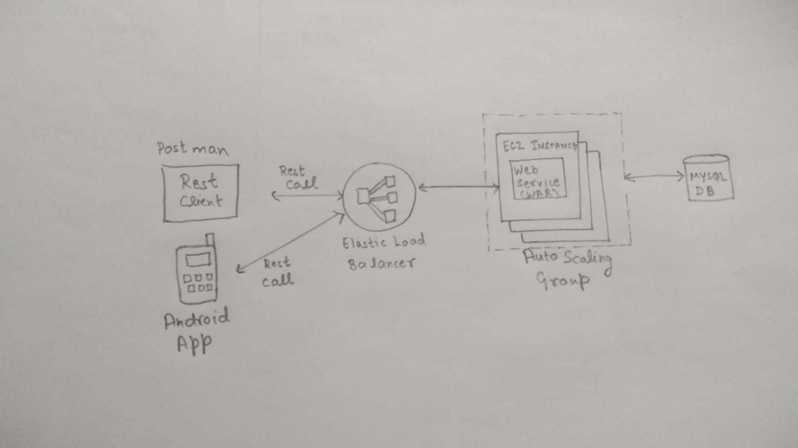
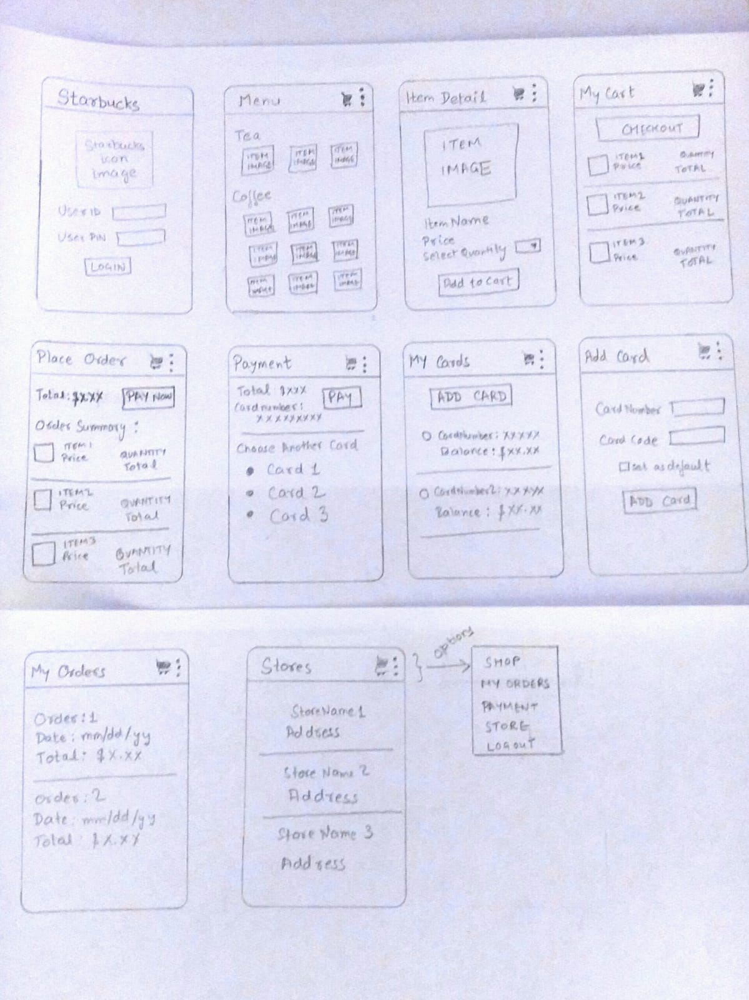

# su18-202-stellar Starbucks APP

###  Starbucks Application built using Java REST APIs.

        • Add Cards API - Implemented a REST API on top of the Starbucks Library to enable Adding Cards.
        • Manage Order API - Implemented a REST API on top of the Starbucks Library to Manage Orders.
        • Payment API - Implemented a REST API on top of the Starbucks Library to enable Payments.
        • Authentication API - Implemented a REST API on top of the Starbucks Library to manage user authentication.
        • Deployed the REST APIs to AWS EC2 and enabled Auto-scaling and load-balancing. 

        
## Component Diagram

            
## EC2 Deployment Diagram

## UI Wireframes Diagram

"# starbucksApp" 
